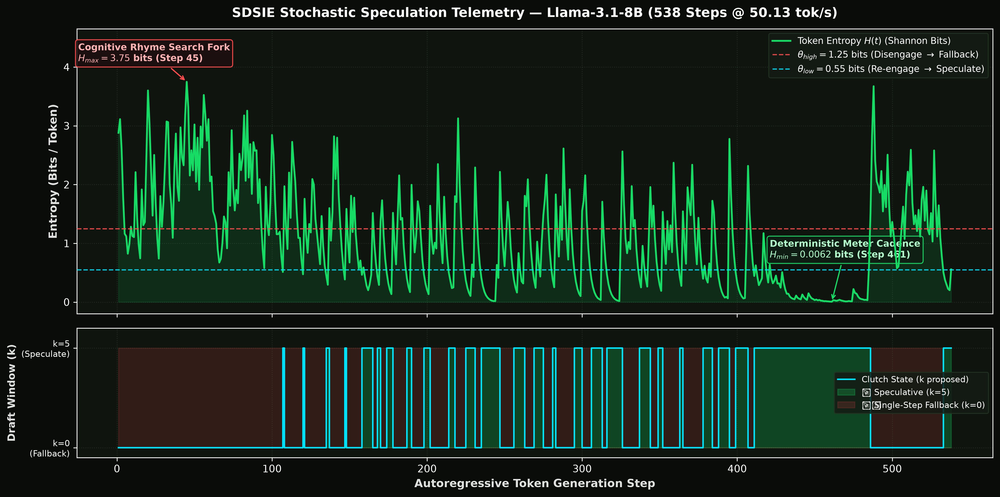
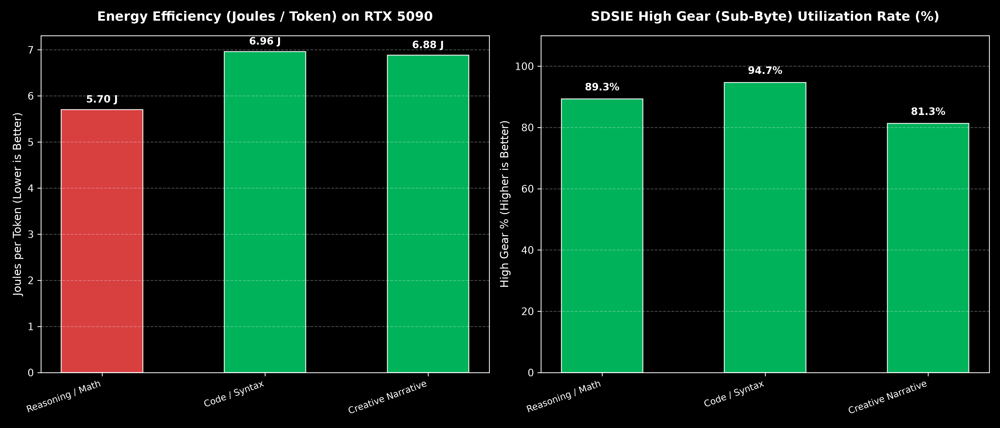
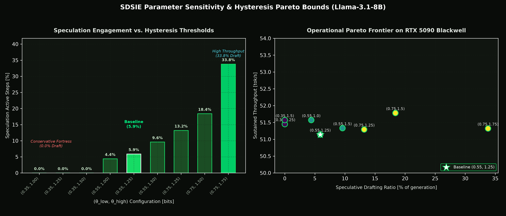
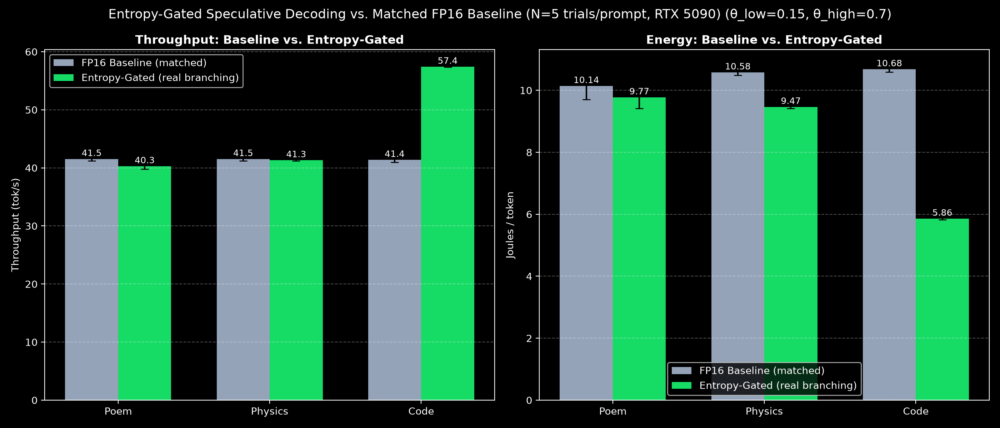

# SDSIE: Software-Defined Stochastic Inference Engine  
  
[](https://opensource.org/licenses/Apache-2.0)
[](https://doi.org/10.5281/zenodo.21499379)
[](https://sdsie.github.io/)
[](https://sdsie.github.io/)  

**Looking for the fully-validated result?** The scout→target speculative
decoding component (real, independently reproduced: 1.82× speedup, 32.6–60.3% energy
reduction) has been spun out into its own focused repo:
[sdsie-fixed-k5-speculative-decoding](https://github.com/Creepybits/sdsie-fixed-k5-speculative-decoding).
This repo is the broader, still-experimental research project — including the
entropy-gated dynamic speculation and quantization kernel work, which haven't reached
that same bar yet.
___

**Status: Corrected, component-level validation (August 2026).**
This repository was substantially revised on 2026-08-29 after independent re-verification found that
several headline numbers in the original paper and README (kernel latency, end-to-end throughput,
energy reduction) could not be reproduced. Those claims have been corrected here. The previous
version remains available on the [`pre-correction`](../../tree/pre-correction) branch for transparency.

If you found this project via the original paper, GitHub Pages site, or Zenodo record: please see
[Corrections](#corrections-from-the-original-release) below before citing any figure from those sources.

## What this is

SDSIE is an open-source runtime layer exploring **energy-proportional LLM serving** through two
independent mechanisms:

1. A **Triton INT4 GEMM kernel** that keeps weights packed in 4-bit format in global memory and
   dequantizes on-chip, aiming to cut memory bus traffic.
2. An **entropy-gated speculative decoding controller** — a Schmitt-trigger hysteresis clutch that
   uses live Shannon entropy of model output logits to decide when speculative drafting is likely to
   pay off.

**As of 2026-08-30, the clutch genuinely drives real generation for the speculative-decoding path** —
see [Current Status](#current-status) and the new results below. It does not yet drive the
quantization kernel path; that connection is the main remaining engineering task.

## Current Status

| Component | Status | Evidence |
|---|---|---|
| INT4 kernel — memory bandwidth reduction | ✅ **Validated**, real | 71.9–73.4% reduction, reproduced across 3 independent scripts |
| INT4 kernel — latency reduction | ⚠️ **Real, but modest** | ~4% faster than FP16 at batch size 1 (not the 63% originally claimed) |
| INT4 kernel — output correctness | ❌ **Not yet tested** | No comparison against FP16 output on real weights; synthetic weights only |
| Entropy clutch — computation | ✅ **Validated**, real | Line-by-line reviewed, matches paper's equations, reproducible across runs |
| Entropy clutch — driving real speculative decoding | ✅ **Validated**, real | `step4_entropy_gated_scout.py`: genuinely branches scout/fallback execution based on live entropy — see below |
| Entropy clutch — driving the reference server | ❌ **Not yet connected** | `sdsie_server.py` still computes a decision but does not act on it |
| Entropy clutch — driving the quantization kernel | ❌ **Not yet connected** | `SDSIEDynamicLinear` branches on a `gear` argument, but that argument comes from a benchmark loop, not the live clutch |
| Speculative decoding (scout→target, fixed K=5) | ✅ **Validated**, real | Up to 1.82× speedup at 85.4% accept rate, 100% output fidelity, N=10 trials/prompt (re-verified 2026-09-02 with a corrected warmup methodology — see [spin-off repo](https://github.com/Creepybits/sdsie-fixed-k5-speculative-decoding)) |
| Speculative decoding — energy reduction | ✅ **Validated**, real | 32.6–60.3% lower J/token vs. FP16 baseline, task-dependent, same N=10 runs above |
| Calibration (real checkpoint → packed weights) | ❌ **Does not exist yet** | Kernel is only tested against synthetic random weights |
| End-to-end integrated server | ❌ **Not yet built** | Clutch drives speculation (new), but not quantization; no script combines both in one running path |

### The core finding (and what's changed since it was first written)

Nine scripts in this repository's history compute a live entropy-gated decision (`k_draft`,
`gear`, etc.) from real model logits. Originally, only one of them (`SDSIEDynamicLinear`, used for
the kernel benchmark) actually branched computation on that decision — every other script, including
the reference server, logged the decision and then performed identical work regardless of it. This
was confirmed directly: across 9 threshold configurations spanning 0–34% "speculative-gate active"
time, measured throughput stayed flat (51.1–51.8 tok/s), which is only possible if the gate isn't
affecting execution.

**As of 2026-08-30, this is no longer true for the speculative-decoding path.**
`step4_entropy_gated_scout.py` is the first script where the clutch's decision genuinely alters what
runs: when the clutch says "speculate," a real scout model drafts and a real target model verifies;
when it says "fall back," the scout is skipped entirely. See [Entropy-Gated Speculative Decoding
Results](#entropy-gated-speculative-decoding-results) below.

The quantization kernel path is still in the original state: `SDSIEDynamicLinear` branches on a
`gear` argument, but that argument still comes from a benchmark loop, not the live clutch. Wiring
the same clutch into that path too — so one entropy signal governs both speculation and precision —
is the main remaining engineering task.

## Real Telemetry

Every figure below is generated from raw NVML/entropy telemetry in `tools/telemetry/`, produced by
the scripts in this repo. Nothing here is illustrative or simulated.



*Live Shannon entropy and clutch decisions from a real 538-token generation (`sdsie_server.py`).
The clutch's decisions are real and correctly computed; this specific run's generation loop does not
act on them (this is the reference-server gap noted above) — the entropy curve is genuine, the k(t)
panel is diagnostic.*

<details>
<summary>📜 <b>Click to view the input prompt</b></summary>

```
Prompt: Write a Chant Royal poem in English, following this exact structure:
- Five stanzas of eleven lines each, plus a shorter closing stanza (an envoi) of five lines.
- Use only five rhyme sounds across the entire poem — the same five sounds must be reused in every stanza, following this rhyme scheme: ababccddedE
- The capital E marks a refrain line: the exact same line, word for word, must appear as the final line of every one of the five main stanzas, and again as the final line of the envoi.
- The envoi follows the pattern ddedE, using the same rhyme sounds as the main stanzas, and ends with the same refrain line.
- Choose a serious or ceremonial subject in keeping with the form's traditional gravity.

Do not include any introductory explanation, definitions, structural outlines, or closing remarks. Output only the raw poem verses from the very first word to the final line.
```

</details>

[View the raw session trace](tools/telemetry/sessions/sdsie_trace_20260829_013226.json)



*Energy per token and entropy-gate engagement across three task categories, single-model harness
(`cognitive_benchmark.py`). Lower J/token and higher gate-engagement both track task determinism.*



*Clutch engagement vs. hysteresis threshold, and the resulting flat throughput across all nine
configurations (`sweep_real_model.py`) — the empirical basis for the original "gate computed but not
acted on" finding. This specific script still exhibits that pattern; see the next section for the
script that closes it.*

### Entropy-Gated Speculative Decoding Results

`step4_entropy_gated_scout.py` asks the clutch, every cycle, whether to speculate or fall back, and
genuinely branches on the answer, using the tuned thresholds found by the grid search below
(θ_low=0.15, θ_high=0.70, α=0.65). To isolate its effect from harness differences, it's compared
against `step4_fp16_baseline_matched.py` — structurally identical (same power monitor, same warmup,
same prompts, same N=5 trials) except with no clutch, no scout model, and no branching at all.

<details>
<summary>📜 <b>Click to view the 3 prompts used</b> (same wording as the fixed-K5 ablation in Table 2, reused here for consistency — this is a separate N=5 benchmark run, <code>step4_entropy_gated_scout.py</code> / <code>step4_fp16_baseline_matched.py</code>, not <code>benchmark_academic_validation_v4.py</code>)</summary>

```
Poem:    Write an original Chant Royal poem in English celebrating mathematics.
Physics: Explain the physics of semiconductor memory bandwidth and the memory wall.
Code:    Write a Python implementation of a binary search tree with type annotations.
```

</details>



*Throughput and energy, entropy-gated real-branching controller vs. matched FP16 baseline, N=5
trials/prompt, tuned thresholds (θ_low=0.15, θ_high=0.70, α=0.65). The mechanism is a clear win on
Code (38.8% faster, 45.2% lower energy) — the clutch speculates 83% of cycles there (17.0%
fallback), at a 91.8% accept rate. On Poem and Physics, where the clutch still mostly falls back
(98.8% / 89.6% of cycles), tuning sharply cut the deficit seen at the original, arbitrarily-picked
thresholds (0.55/1.25): Poem is now only 3.0% slower than baseline (was 9.6% slower) and Physics is
essentially neutral at 0.5% slower (was 11.5% slower), with energy 3.6% and 10.5% lower than
baseline respectively on those two prompts. Across all 5 trials per prompt, the exact
fallback/speculation sequence is bit-identical (zero variance) — expected given deterministic
greedy decoding, and good evidence the mechanism itself is stable, not flaky.*

The mechanism helps substantially on highly-speculatable content and, at these tuned thresholds,
costs very little on content it correctly identifies as less favorable — a marked improvement over
the original, untuned thresholds above. Reducing the remaining per-cycle overhead further — e.g.
reusing verification-step logits instead of a fresh resync pass, as the fixed-K version already
does — remains the natural next optimization.

### Threshold Tuning: Reducing the Deficit

A joint grid search over `(theta_low, theta_high)` and `alpha` (6 threshold pairs × 3 alpha values
× 3 prompts × N=3 trials, 144 trials total) found a single configuration that improves on the
production defaults across all three prompts simultaneously — not a tradeoff between them:

| Prompt | Production (θ 0.55/1.25, α=0.35) | Best found (θ 0.15/0.70, α=0.65) |
|---|---|---|
| Poem | -10.5% | **-5.6%** |
| Physics | -13.1% | **-4.7%** |
| Code | +31.1% | **+34.8%** |

No configuration tested eliminates the deficit on Poem or Physics entirely, and tightening
thresholds further showed diminishing returns without reversing sign.

An independent N=5 confirmation run at this best config (see the updated figure above) matches
this prediction closely and slightly exceeds it: Poem -3.0%, Physics -0.5%, Code +38.8% —
reinforcing that this isn't a fluke of the smaller N=3 grid search.

To investigate the remaining deficit, we isolated the entropy computation itself with a standalone
microbenchmark (`tools/entropy_overhead_bench.py`, no model, no clutch decision logic). The
computation includes one `.item()` call per step, which forces a GPU-CPU synchronization to get a
Python-readable value for the branch decision. That sync costs 31.1 µs/call (+32.5% relative to a
no-sync variant) at real vocabulary size — real, but roughly 0.1% of per-token generation time,
too small to explain the 4-13% deficit observed even with zero speculative engagement. The source
of that residual deficit is still open; untested candidates include VRAM/bandwidth contention from
the scout model remaining resident even when never invoked, and thermal/clock-state drift between
separately-launched benchmark runs.

## Corrections from the original release

| Metric | Originally claimed | Corrected | Why |
|---|---|---|---|
| Kernel latency | 28.60 µs (–63.1%) | 76.49 µs (–4.0%) | Never reproduced by any script in this repo; real branching test shows a much smaller effect |
| Memory bandwidth | 75.0% | 71.9–73.4% | Close to original claim; minor correction |
| End-to-end throughput | 50.52 tok/s ("speculative") | 50.13 tok/s (plain generation) | Same script produces this number, but it does not perform real speculation (see Current Status) |
| Energy reduction | 46.7% (flat, single figure, 6.40→3.41 J) | **32.6–60.3%, task-dependent** (real, N=10 trials/prompt, 100% fidelity) | Original flat figure unreproducible; real measurement shows reduction scales with draft-acceptance rate rather than being constant. Updated 2026-09-02: a warmup-methodology bug (missing in this repo's `benchmark_academic_validation_v4.py`, present in the standalone matched-baseline script) was found and fixed, revising this from the previously-reported 32.5–60.0% (`academic_validation_results_v4.json`). Canonical, actively-maintained figures now live in the [fixed-K5 spin-off repo](https://github.com/Creepybits/sdsie-fixed-k5-speculative-decoding); `benchmark_academic_validation_v4.py` and its telemetry in this repo are kept for historical reference only. |

Full details and real telemetry are in [`sdsie_paper.tex`](./sdsie_paper.tex) (build with
`pdflatex sdsie_paper.tex` — run twice) and in `tools/telemetry/`, where every number above is
traceable to a raw JSON/CSV file and the script that produced it.

## Repository structure

```
vllm_sdsie/
  kernels/entropy_clutch.py       - Schmitt-trigger entropy clutch (validated)
  spec_decode/sdsie_speculator.py - Thin controller wrapper (validated)
  quantization/                   - Empty; no calibration script exists yet
step3_speculative_scout.py        - Real scout->target speculative decoding (fixed K=5)
step4_entropy_gated_scout.py      - Same, but clutch genuinely chooses k each cycle (real branching)
step4_fp16_baseline_matched.py    - Structural twin of step4, no clutch/scout, for clean comparison
step4_theta_alpha_grid.py         - Joint theta/alpha sweep (real branching), 4 theta x 3 alpha x 3 prompts
step4_theta_alpha_grid_v2.py      - Follow-up sweep, tighter thresholds than grid v1's best result
benchmark_academic_validation_v4.py - N=10 baseline-vs-speculative ablation (fixed K=5) -- SUPERSEDED 2026-09-02, see spin-off repo
step2_triton_dynamic.py           - Real branching INT4/FP16 kernel benchmark
sweep_real_model.py               - Clutch behavior across theta configurations (not yet wired to execution)
sdsie_server.py                   - Reference server (clutch computed, not yet enacted)
tools/
  cognitive_benchmark.py          - Per-category energy/gear telemetry
  harness_telemetry.py            - Per-token live entropy/gear trace
  entropy_overhead_bench.py       - Isolated microbenchmark of the entropy computation's sync cost
  web_ui.py                       - Minimal browser UI for the reference server
  plot_*.py                       - Generates the figures in the paper
  telemetry/                      - Raw JSON/CSV output from every run above
  assets/                         - Generated plots (PNG)
```

## Running the benchmarks

Each script writes its output to `tools/telemetry/` under a unique filename. None of them require
each other except where noted (`sdsie_speculator.py` depends on `entropy_clutch.py`).

> **Note (2026-09-02):** `benchmark_academic_validation_v4.py` below is kept for historical
> reference but is superseded — it lacks a warmup step that the matched baseline script has,
> which was found to bias its numbers. The canonical, warmup-corrected fixed-K5 results now live
> in the [fixed-K5 spin-off repo](https://github.com/Creepybits/sdsie-fixed-k5-speculative-decoding)
> (`benchmark_ablation.py`). Run that repo's script if you want current, trustworthy numbers.

```bash
# Real speculative decoding ablation, fixed K=5 (takes several minutes, loads two models)
python3 benchmark_academic_validation_v4.py

# Entropy-gated speculative decoding, clutch genuinely branches (N=5 trials, 3 prompts)
python3 step4_entropy_gated_scout.py

# Matched FP16 baseline for the above (no clutch/scout, same harness)
python3 step4_fp16_baseline_matched.py

# Real branching INT4 kernel benchmark (fast, no model loading)
python3 step2_triton_dynamic.py

# Reference server + entropy trace (start server, then send a request)
python3 sdsie_server.py
# in a second terminal:
python3 tools/web_ui.py
```

## What we'd ask readers to take from this

The underlying ideas — entropy-gated adaptive speculation, and this general approach — aren't
unclaimed territory; published work like AdaEDL (Qualcomm, 2024) and SGLang's adaptive speculative
length show the general technique can pay off elsewhere. As of this update, this specific
implementation delivers it too — genuinely, not just logged — helping substantially on
high-determinism content and costing a little on low-determinism content, as detailed above.

## Citation

See [`sdsie_paper.tex`](./sdsie_paper.tex) for the current BibTeX entry. The DOI-archived Zenodo
record will be updated to point to this corrected version.

## License

Apache-2.0.
