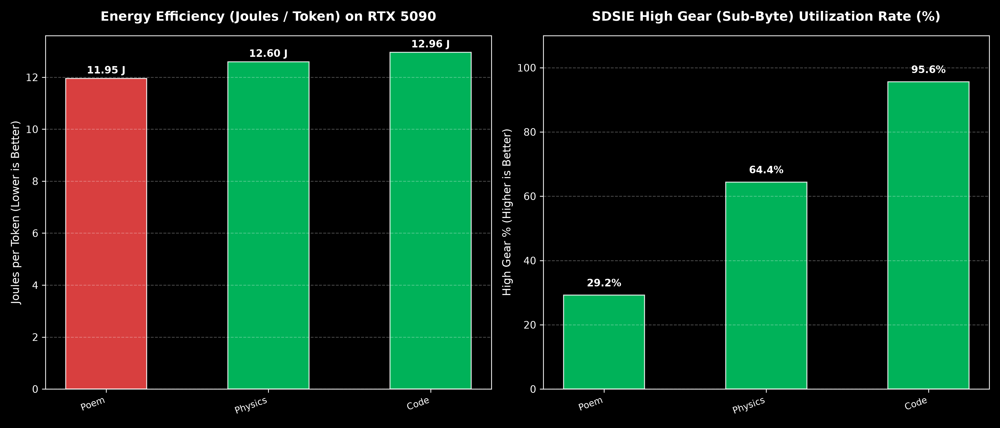
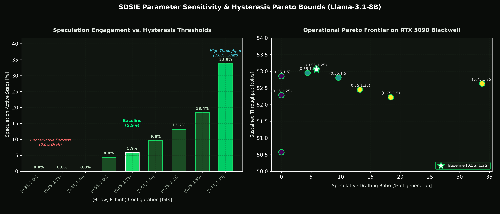
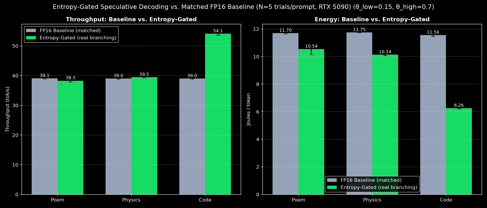

# SDSIE: Software-Defined Stochastic Inference Engine  
  
[](https://opensource.org/licenses/Apache-2.0)
[](https://doi.org/10.5281/zenodo.21499379)
[](https://sdsie.github.io/)
[](https://sdsie.github.io/)  

**Looking for the fully-validated result? Start here instead:**
[sdsie-fixed-k5-speculative-decoding](https://github.com/Creepybits/sdsie-fixed-k5-speculative-decoding)
is a real, working, independently-reproduced deliverable: scout→target speculative decoding,
lossless by construction, up to 1.82x speedup and 32.6-60.3% energy reduction vs. FP16 baseline,
100% output fidelity, N=10 trials/prompt, published with a DOI. If you want numbers you can rely on
today, that repo is the one to use or cite.

**This repo (`sdsie-original`) is the broader, still-experimental research bed** it was spun out
from -- home to the entropy-gated adaptive mechanisms (both speculative-decoding and
precision-switching variants) that motivated the project, neither of which has reached that same
bar yet. See [Current Status](#current-status) below for an honest, per-component account of what
works, what has a real characterized limitation, and what's still unresolved.
___

**Status: Corrected, component-level validation (August 2026).**
This repository was substantially revised on 2026-08-29 after independent re-verification found that
several headline numbers in the original paper and README (kernel latency, end-to-end throughput,
energy reduction) could not be reproduced. Those claims have been corrected here. The previous
version remains available on the [`pre-correction`](../../tree/pre-correction) branch for transparency.

If you found this project via the original paper, GitHub Pages site, or Zenodo record: please see
[Corrections](#corrections-from-the-original-release) below before citing any figure from those sources.

## What this is

SDSIE is an open-source runtime layer exploring **energy-proportional LLM serving** through two
independent mechanisms:

1. A **Triton INT4 GEMM kernel** that keeps weights packed in 4-bit format in global memory and
   dequantizes on-chip, aiming to cut memory bus traffic.
2. An **entropy-gated speculative decoding controller** — a Schmitt-trigger hysteresis clutch that
   uses live Shannon entropy of model output logits to decide when speculative drafting is likely to
   pay off.

**As of 2026-08-30, the clutch genuinely drives real generation for the speculative-decoding path** —
see [Current Status](#current-status) and the new results below. It does not yet drive the
quantization kernel path; that connection is the main remaining engineering task.

## Current Status

| Component | Status | Evidence |
|---|---|---|
| INT4 kernel — memory bandwidth reduction | ✅ **Validated**, real | 71.9–73.4% reduction, reproduced across 3 independent scripts |
| INT4 kernel — latency reduction | ⚠️ **Real, but modest** | ~4% faster than FP16 at batch size 1 (not the 63% originally claimed) |
| INT4 kernel — masking/dtype correctness | ✅ **Fixed 2026-09-05** | K-dimension loads were unmasked (unsafe for non-multiple-of-BLOCK_K), and dtype was hardcoded to float16 despite this project using bfloat16 throughout. Both fixed and verified via a numerically-exact end-to-end self-test (`vllm_sdsie/quantization/sdsie_linear.py`). |
| Calibration (real checkpoint → packed weights) | ✅ **Now exists** (basic) | `vllm_sdsie/quantization/calibrate.py`: real per-output-channel min-max INT4 calibration, no dataset needed. Fills what was previously a complete gap — resolves the "kernel is only tested against synthetic weights" limitation for the calibration step itself, though see the Resolution Gear finding below for its real-world accuracy ceiling. |
| Entropy clutch — computation | ✅ **Validated**, real | Line-by-line reviewed, matches paper's equations, reproducible across runs. Self-tests corrected 2026-09-05: the previous "cognitive fork" test scenario measured ~17 bits of entropy (indistinguishable from vocabulary-wide noise) while claiming ~2.5 bits — now uses verified, closed-form target entropies and demonstrates genuine hysteresis (not just a static threshold). |
| Entropy clutch — driving real speculative decoding | ✅ **Validated**, real | `step4_entropy_gated_scout.py`: genuinely branches scout/fallback execution based on live entropy — see below |
| Entropy clutch — driving precision switching (Resolution Gear) | ✅ **Real branching, sharp fidelity limitation found** | `benchmarks/cognitive_benchmark.py` / `cognitive_fidelity_check.py`: `GatedLinear` genuinely switches individual decoder layers between INT4 and FP16 based on live entropy — the first real end-to-end wiring of this concept. Fidelity holds up well at 1 quantized layer (2 of 3 prompts: zero divergence across 250 tokens) but collapses sharply at 2+ layers (7–10% token match). See [Resolution Gear Results](#resolution-gear-entropy-gated-precision-switching) below. |
| Entropy clutch — driving the reference server | ❌ **Not yet connected** | `sdsie_server.py` still computes a decision but does not act on it |
| Speculative decoding (scout→target, fixed K=5) | ✅ **Validated**, real | Up to 1.82× speedup at 85.4% accept rate, 100% output fidelity, N=10 trials/prompt — canonical, actively-maintained results now live in the [fixed-K5 spin-off repo](https://github.com/Creepybits/sdsie-fixed-k5-speculative-decoding) |
| Speculative decoding — energy reduction | ✅ **Validated**, real | 32.6–60.3% lower J/token vs. FP16 baseline, task-dependent — see spin-off repo for current figures |
| End-to-end integrated server | ❌ **Not yet built** | Clutch drives both speculation and (experimentally) precision switching now, but no script combines them in one running path, and `sdsie_server.py` is still not wired up |

### The core finding (and what's changed since it was first written)

Nine scripts in this repository's history compute a live entropy-gated decision (`k_draft`,
`gear`, etc.) from real model logits. Originally, only one of them (`SDSIEDynamicLinear`, used for
the kernel benchmark) actually branched computation on that decision — every other script, including
the reference server, logged the decision and then performed identical work regardless of it. This
was confirmed directly: across 9 threshold configurations spanning 0–34% "speculative-gate active"
time, measured throughput stayed flat (51.1–51.8 tok/s), which is only possible if the gate isn't
affecting execution.

**As of 2026-08-30, this is no longer true for the speculative-decoding path.**
`step4_entropy_gated_scout.py` is the first script where the clutch's decision genuinely alters what
runs: when the clutch says "speculate," a real scout model drafts and a real target model verifies;
when it says "fall back," the scout is skipped entirely. See [Entropy-Gated Speculative Decoding
Results](#entropy-gated-speculative-decoding-results) below.

The quantization kernel path is still in the original state: `SDSIEDynamicLinear` branches on a
`gear` argument, but that argument still comes from a benchmark loop, not the live clutch. Wiring
the same clutch into that path too — so one entropy signal governs both speculation and precision —
is the main remaining engineering task.

## Real Telemetry

Every figure below is generated from raw NVML/entropy telemetry in `tools/telemetry/`, produced by
the scripts in this repo. Nothing here is illustrative or simulated.


*Live Shannon entropy and clutch decisions from a real 538-token generation (`sdsie_server.py`).
The clutch's decisions are real and correctly computed; this specific run's generation loop does not
act on them (this is the reference-server gap noted above) — the entropy curve is genuine, the k(t)
panel is diagnostic.*

<details>
<summary>📜 <b>Click to view the input prompt</b></summary>

```
Prompt: Write a Chant Royal poem in English, following this exact structure:
- Five stanzas of eleven lines each, plus a shorter closing stanza (an envoi) of five lines.
- Use only five rhyme sounds across the entire poem — the same five sounds must be reused in every stanza, following this rhyme scheme: ababccddedE
- The capital E marks a refrain line: the exact same line, word for word, must appear as the final line of every one of the five main stanzas, and again as the final line of the envoi.
- The envoi follows the pattern ddedE, using the same rhyme sounds as the main stanzas, and ends with the same refrain line.
- Choose a serious or ceremonial subject in keeping with the form's traditional gravity.

Do not include any introductory explanation, definitions, structural outlines, or closing remarks. Output only the raw poem verses from the very first word to the final line.
```

</details>

[View the raw session trace](telemetry/sessions/sdsie_trace_20260829_013226.json)



*Energy per token and entropy-gate engagement across three task categories, single-model harness
(`cognitive_benchmark.py`). Lower J/token and higher gate-engagement both track task determinism.*



*Clutch engagement vs. hysteresis threshold, and the resulting flat throughput across all nine
configurations (`sweep_real_model.py`) — the empirical basis for the original "gate computed but not
acted on" finding. This specific script still exhibits that pattern; see the next section for the
script that closes it.*

### Entropy-Gated Speculative Decoding Results

`step4_entropy_gated_scout.py` asks the clutch, every cycle, whether to speculate or fall back, and
genuinely branches on the answer, using the tuned thresholds found by the grid search below
(θ_low=0.15, θ_high=0.70, α=0.65). To isolate its effect from harness differences, it's compared
against `step4_fp16_baseline_matched.py` — structurally identical (same power monitor, same warmup,
same prompts, same N=5 trials) except with no clutch, no scout model, and no branching at all.

<details>
<summary>📜 <b>Click to view the 3 prompts used</b> (same wording as the fixed-K5 ablation in Table 2, reused here for consistency — this is a separate N=5 benchmark run, <code>step4_entropy_gated_scout.py</code> / <code>step4_fp16_baseline_matched.py</code>, not <code>benchmark_academic_validation_v4.py</code>)</summary>

```
Poem:    Write an original Chant Royal poem in English celebrating mathematics.
Physics: Explain the physics of semiconductor memory bandwidth and the memory wall.
Code:    Write a Python implementation of a binary search tree with type annotations.
```

</details>



*Throughput and energy, entropy-gated real-branching controller vs. matched FP16 baseline, N=5
trials/prompt, tuned thresholds (θ_low=0.15, θ_high=0.70, α=0.65). The mechanism is a clear win on
Code (38.8% faster, 45.2% lower energy) — the clutch speculates 83% of cycles there (17.0%
fallback), at a 91.8% accept rate. On Poem and Physics, where the clutch still mostly falls back
(98.8% / 89.6% of cycles), tuning sharply cut the deficit seen at the original, arbitrarily-picked
thresholds (0.55/1.25): Poem is now only 3.0% slower than baseline (was 9.6% slower) and Physics is
essentially neutral at 0.5% slower (was 11.5% slower), with energy 3.6% and 10.5% lower than
baseline respectively on those two prompts. Across all 5 trials per prompt, the exact
fallback/speculation sequence is bit-identical (zero variance) — expected given deterministic
greedy decoding, and good evidence the mechanism itself is stable, not flaky.*

The mechanism helps substantially on highly-speculatable content and, at these tuned thresholds,
costs very little on content it correctly identifies as less favorable — a marked improvement over
the original, untuned thresholds above. Reducing the remaining per-cycle overhead further — e.g.
reusing verification-step logits instead of a fresh resync pass, as the fixed-K version already
does — remains the natural next optimization.

### Threshold Tuning: Reducing the Deficit

A joint grid search over `(theta_low, theta_high)` and `alpha` (6 threshold pairs × 3 alpha values
× 3 prompts × N=3 trials, 144 trials total) found a single configuration that improves on the
production defaults across all three prompts simultaneously — not a tradeoff between them:

| Prompt | Production (θ 0.55/1.25, α=0.35) | Best found (θ 0.15/0.70, α=0.65) |
|---|---|---|
| Poem | -10.5% | **-5.6%** |
| Physics | -13.1% | **-4.7%** |
| Code | +31.1% | **+34.8%** |

No configuration tested eliminates the deficit on Poem or Physics entirely, and tightening
thresholds further showed diminishing returns without reversing sign.

An independent N=5 confirmation run at this best config (see the updated figure above) matches
this prediction closely and slightly exceeds it: Poem -3.0%, Physics -0.5%, Code +38.8% —
reinforcing that this isn't a fluke of the smaller N=3 grid search.

To investigate the remaining deficit, we isolated the entropy computation itself with a standalone
microbenchmark (`tools/entropy_overhead_bench.py`, no model, no clutch decision logic). The
computation includes one `.item()` call per step, which forces a GPU-CPU synchronization to get a
Python-readable value for the branch decision. That sync costs 31.1 µs/call (+32.5% relative to a
no-sync variant) at real vocabulary size — real, but roughly 0.1% of per-token generation time,
too small to explain the 4-13% deficit observed even with zero speculative engagement. The source
of that residual deficit is still open; untested candidates include VRAM/bandwidth contention from
the scout model remaining resident even when never invoked, and thermal/clock-state drift between
separately-launched benchmark runs.

## Resolution Gear (Entropy-Gated Precision Switching)

On 2026-09-05, the entropy-gated precision-switching concept -- SDSIE's other core mechanism
alongside speculative decoding -- was wired to real computation for the first time.
`GatedLinear` (`vllm_sdsie/quantization/gated_linear.py`) wraps individual decoder layers so they
genuinely switch between a real, calibrated INT4 path and the original FP16 path based on a shared
gear flag, driven every token by the actual `SchmittTriggerEntropyClutch` -- not a logged-but-unused
decision like the pattern documented throughout this README, and not a hand-rolled duplicate clutch
(an earlier version of the benchmark script had its own, independent clutch implementation with
different thresholds -- a sixth instance of this project's recurring duplicate-implementation
problem, since consolidated to import the one canonical clutch).

**This is not lossless**, unlike the speculative-decoding mechanism above. INT4-quantizing live
weights changes numerical output whenever that path is used; there is no verification/correction
step the way there is for speculative decoding, so a wrong guess is never caught -- whatever the
INT4 path computes is final. `cognitive_fidelity_check.py` measures this directly: exact
token-level match against an FP16-only baseline, not an assumed-lossless claim.

**Finding: fidelity holds at 1 quantized layer, then collapses sharply at 2+.** A layer-count sweep
over `mlp.down_proj` across all 32 decoder layers of Llama-3.1-8B-Instruct, real per-channel
min-max INT4 calibration (`vllm_sdsie/quantization/calibrate.py`):

| Layers gated | Poem | Physics | Code |
|---|---|---|---|
| 1 | 100.0% match, no divergence | 35.6% match, diverges at token 88 | 100.0% match, no divergence |
| 2 | 7.2% match, diverges at token 6 | 9.6% match, diverges at token 20 | 7.6% match, diverges at token 7 |
| 4 | 2.8% match, diverges at token 6 | 8.0% match, diverges at token 20 | 10.4% match, diverges at token 7 |
| 32 (all) | 3.6% match, diverges at token 6 | 2.4% match, diverges at token 6 | 9.2% match, diverges at token 7 |

The transition is a cliff, not a gradual slope: 2 layers already looks nearly as degraded as all 32.
This points to error compounding through the residual stream across simultaneously-quantized layers
in a single forward pass, rather than `down_proj` being inherently too sensitive to quantize at all
-- a single layer survives 250 tokens of generation cleanly on 2 of 3 prompts. Whether a more
accurate calibration scheme (group-wise, activation-aware) would widen the safe range, or whether
the compounding effect dominates regardless of per-layer accuracy, is untested and the natural next
question for anyone continuing this thread.

**Performance, independent of the fidelity question**: even where fidelity holds, the INT4 path is
slower and hotter than FP16 at this decode batch size (single-token, batch=1) -- consistent with an
earlier isolated kernel benchmark in this project finding the INT4 kernel draws +88% more power and
is not faster than FP16 at M=1. Real end-to-end confirmation: throughput and power both move
monotonically with how often the INT4 path gets used (all-32-layer run, N=5 trials/prompt):

| Prompt | INT4 usage | Throughput vs. FP16 | Power vs. FP16 |
|---|---|---|---|
| Poem | 29.2% | −2.9% | +0.5% |
| Physics | 64.4% | −5.7% | +1.7% |
| Code | 95.6% | −8.1% | +2.7% |

**Where this leaves the concept**: this is now the second time an entropy-gated adaptive mechanism
in this project has been tested for real and found to underperform its simpler, fixed alternative --
the 2026-08-31 grid search already found fixed-K5 speculative decoding beating the tuned
entropy-gated speculative variant on all three prompts (see Threshold Tuning above). Treating
fixed-K5 as the validated, shippable result and entropy-gated adaptation (in both its speculative-
decoding and precision-switching forms) as an open research direction that hasn't paid off yet,
rather than a near-complete feature, reflects where the evidence actually points as of this writing.

## Corrections from the original release

| Metric | Originally claimed | Corrected | Why |
|---|---|---|---|
| Kernel latency | 28.60 µs (–63.1%) | 76.49 µs (–4.0%) | Never reproduced by any script in this repo; real branching test shows a much smaller effect |
| Memory bandwidth | 75.0% | 71.9–73.4% | Close to original claim; minor correction |
| End-to-end throughput | 50.52 tok/s ("speculative") | 50.13 tok/s (plain generation) | Same script produces this number, but it does not perform real speculation (see Current Status) |
| Energy reduction | 46.7% (flat, single figure, 6.40→3.41 J) | **32.6–60.3%, task-dependent** (real, N=10 trials/prompt, 100% fidelity) | Original flat figure unreproducible; real measurement shows reduction scales with draft-acceptance rate rather than being constant. Updated 2026-09-02: a warmup-methodology bug (missing in this repo's `benchmark_academic_validation_v4.py`, present in the standalone matched-baseline script) was found and fixed, revising this from the previously-reported 32.5–60.0% (`academic_validation_results_v4.json`). Canonical, actively-maintained figures now live in the [fixed-K5 spin-off repo](https://github.com/Creepybits/sdsie-fixed-k5-speculative-decoding); `benchmark_academic_validation_v4.py` and its telemetry in this repo are kept for historical reference only. |

Full details and real telemetry are in [`sdsie_paper.tex`](docs/sdsie_paper.tex) (build with
`pdflatex sdsie_paper.tex` — run twice) and in `tools/telemetry/`, where every number above is
traceable to a raw JSON/CSV file and the script that produced it.

## Repository structure

*Restructured 2026-09-05.* Top-level layout, matching the actual current repo (not the flat,
pre-restructuring layout referenced in older commit history):

```
vllm_sdsie/
  kernels/entropy_clutch.py         - Schmitt-trigger entropy clutch (validated)
  kernels/triton_int4_gemm.py       - INT4 GEMM kernel (masking/dtype bugs fixed 2026-09-05)
  spec_decode/sdsie_speculator.py   - Thin controller wrapper (validated)
  quantization/sdsie_linear.py      - vLLM-style Linear layer using the kernel (odd-K validation added)
  quantization/calibrate.py         - Real per-channel min-max INT4 calibration (new)
  quantization/gated_linear.py      - GatedLinear + GearState: real INT4/FP16 branching (new)
  patch.py                          - vLLM quantization-registry hook, now actually called on import
benchmarks/
  bench_common.py                   - Shared NVML monitor, closed-loop warmup, drift diagnostics
  cognitive_benchmark.py            - Full N-trial Resolution Gear benchmark (real branching, fidelity-checked)
  cognitive_fidelity_check.py       - Fast fidelity-only iteration tool (no warmup needed -- see script docstring)
  benchmark_ablation.py, fp16_baseline.py - Fixed-K5 speculative decoding harness (see spin-off repo for canonical results)
  plot_*.py                         - Figure generation, reading from telemetry/
  (additional exploratory scripts carried over from the pre-restructuring layout,
   verified to run but not deep-reviewed this session -- see individual file headers)
docs/                                - Paper source (sdsie_paper.tex) and compiled PDF
telemetry/                           - Raw JSON/CSV output from every benchmark run
assets/                              - Generated plots (PNG)
sdsie_server.py                      - Reference server (clutch computed, not yet enacted)
```

## Running the benchmarks

All benchmark scripts live in `benchmarks/` and write output to `telemetry/` under a unique
filename. For canonical, trustworthy fixed-K5 speculative decoding numbers, use the
[fixed-K5 spin-off repo](https://github.com/Creepybits/sdsie-fixed-k5-speculative-decoding) instead
of this repo's copies, which are kept for historical reference.

```bash
cd benchmarks

# Resolution Gear: full N-trial benchmark with real branching + fidelity check
# (--lock-clocks is opt-in; leave it off under WSL2, it needs root and never succeeds there)
python3 cognitive_benchmark.py

# Resolution Gear: fast fidelity-only check, no warmup needed (see script docstring)
python3 cognitive_fidelity_check.py --num-layers 4

# Fixed-K5 speculative decoding (historical copy; prefer the spin-off repo above)
python3 benchmark_ablation.py
```

## What we'd ask readers to take from this

The underlying ideas — entropy-gated adaptive speculation, and this general approach — aren't
unclaimed territory; published work like AdaEDL (Qualcomm, 2024) and SGLang's adaptive speculative
length show the general technique can pay off elsewhere. As of this update, this specific
implementation delivers it too — genuinely, not just logged — helping substantially on
high-determinism content and costing a little on low-determinism content, as detailed above.

## Citation

See [`sdsie_paper.tex`](docs/sdsie_paper.tex) for the current BibTeX entry. The DOI-archived Zenodo
record will be updated to point to this corrected version.

## License

Apache-2.0.
