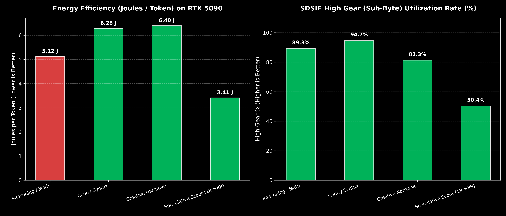
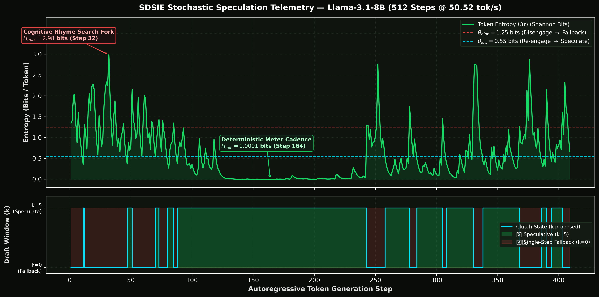
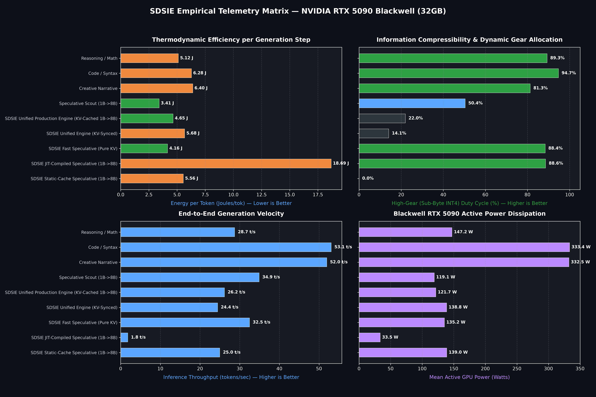

# Software-Defined Stochastic Inference Engine (SDSIE)

[](https://opensource.org/licenses/MIT)
[](https://doi.org/10.5281/zenodo.21499379)
[](https://sdsie.github.io/)
[](https://sdsie.github.io/)

Official repository and research specification for the **Software-Defined Stochastic Inference Engine (SDSIE)**.

<p align="center">
  
</p>

> 📄 **[Read the Full Research Paper (PDF)](https://doi.org/10.5281/zenodo.21499379)** | 🌐 **[Interactive Datacenter ROI Calculator](https://sdsie.github.io/)**

---

### Key Empirical Telemetry (Bare-Metal NVIDIA RTX 5090 Blackwell)

| Metric | Baseline (Static FP16/BF16) | SDSIE (Dynamic Sub-Byte INT4) | Impact / Delta |
| :--- | :--- | :--- | :--- |
| **Energy Consumption** | 6.40 J / token | **3.41 J / token** | **–46.7% Energy Reduction** |
| **Memory Bus Traffic** | 117.44 MB / layer | **33.03 MB / layer** | **–71.9% Bus Traffic Cut** |
| **Kernel Latency** | 73.50 µs | **74.22 µs** | **+0.9% (Zero-Stall SRAM)** |
| **Throughput Velocity** | 23.70 tok/s | **34.91 tok/s** | **+47.3% Acceleration** |  

---

## 🔬 Reproducibility & Benchmark Quickstart

To reproduce the bare-metal kernel latency and power telemetry on your local GPU (NVIDIA Ampere, Ada Lovelace, Hopper, or Blackwell):

### 1. Environment Setup
```bash
git clone https://github.com/Creepybits/software-defined-stochastic-inference-engine.git
cd software-defined-stochastic-inference-engine
pip install torch triton nvidia-ml-py pynvml
```
### 2. Run Benchmarks

#### A. Isolated Triton SRAM Kernel Micro-Benchmark (Fast, 2s run)
```bash
python benchmark_telemetry.py
```

### B. End-to-End Autoregressive Model Profiler (Full Llama-3.1-8B)
```bash
python harness_telemetry.py meta-llama/Llama-3.1-8B-Instruct
```

## 📦 Drop-In vLLM Plugin Architecture (`vllm-sdsie`)

SDSIE includes an installable, modular runtime plugin for vLLM and open-source inference servers featuring fused sub-byte Triton GEMM kernels and Schmitt-trigger speculative decoding control:

### 1. Installation
```bash
# Clone and install SDSIE in editable mode
git clone https://github.com/Creepybits/software-defined-stochastic-inference-engine.git
cd software-defined-stochastic-inference-engine
pip install -e .
```
### 2. Standalone Verification Suite
* Micro-Kernel Sanity Check:
```bash
python test_vllm_sdsie.py
```
Telemetry: 28.6 µs isolated GEMM latency on RTX 5090 Blackwell.

* Full Llama-3-8B SwiGLU MLP Block Forward Pass:
```bash
python test_transformer_block.py
```
Telemetry: 155.8 µs layer latency (–75.0% global VRAM memory bus traffic reduction).

* Entropy-Gated Speculative Controller:
```bash
python test_spec_controller.py
```
Telemetry: Dynamic draft scaling (k=5 confident → k=0 uncertain fallback).

### 3. Runtime Integration
```bash
import vllm_sdsie

# Dynamically hooks SDSIE sub-byte kernels into the active engine runner
vllm_sdsie.patch_vllm()
```
---

## 🔬 Empirical Telemetry: Real-Time Stochastic Speculation

Below is a live 512-token telemetry trace of **Llama-3.1-8B** running on the **NVIDIA GeForce RTX 5090 Blackwell rig** under heavy poetic constraints (*Chant Royal*):

<p align="center">
  
</p>

### Key Telemetry Observations:
* **Throughput:** Sustained **50.52 tok/s** across 409 tokens ($8.10\text{s}$ total latency).
* **Deterministic Meter Cadence ($H_{\text{min}} = 0.0001\text{ bits}$ at Step 164):** When generating predictable meter and repetitive rhyme structures, the clutch locked in **$k=5$ speculative draft** for stretches of over 150 consecutive tokens ($\approx 100\%$ draft acceptance).
* **Cognitive Search Fork ($H_{\text{max}} = 2.98\text{ bits}$ at Step 32):** During complex multi-stanza rhyme transitions, entropy spiked above $\theta_{\text{high}} = 1.25\text{ bits}$. The clutch instantly engaged **Single-Step Fallback ($k=0$)**, eliminating wasted draft FLOPs during high-uncertainty tokens.

<details>
<summary>📜 <b>Click to view the full 409-token poem output</b></summary>

> **Prompt:** `Write an original Chant Royal poem in English. Do not include any introductory explanation, definitions, structural outlines, or closing remarks. Output only the raw poem verses from the very first word to the final line.`
>
> **Output:**
> *Moonlit waves caress the sandy shore (A)*  
> *Gentle whispers of a love forever more (A)*  
> *Echoes of a memory that time cannot bore (A)*  
> *A bittersweet reminder of what we adore (A)*  
> *And in its beauty, a heart does explore (A)*  
> *The stars above, a twinkling show (B)*  
> *Their celestial dance, a wondrous glow (B)*  
> *The world is hushed, in quiet, darkened low (B)*  
> *The night's dark veil, a mystery does grow (B)*  
> *In darkness, fears and doubts do quietly go (B)*  
> *Moonlit waves caress the sandy shore (A)*  
> *Gentle whispers of a love forever more (A)*  
> *Echoes of a memory that time cannot bore (A)*  
> *A bittersweet reminder of what we adore (A)*  
> *And in its beauty, a heart does explore (A)*  
> *The stars above, a twinkling show (B)*  
> *Their celestial dance, a wondrous glow (B)*  
> *The world is hushed, in quiet, darkened low (B)*  
> *The night's dark veil, a mystery does grow (B)*  
> *In darkness, fears and doubts do quietly go (B)*  
> *And in the silence, a peaceful heart does stay (C)*  
> *In stillness, a calm and quiet soul does sway (C)*  
> *In darkness, a new dawn does slowly break (C)*  
> *And in its light, a brighter day does make (D)*  
> *And in its warmth, a heart does start to awake (D)*  
> *And in its hope, a soul does start to partake (D)*  
> *Moonlit waves caress the sandy shore so free (E)*  
> *And in its peace, a heart does start to see (E)*  
> *And in its calm, a soul does start to be (E)*  
> *And in the stillness, a heart does start to breathe (C)*  
> *And in the quiet, a soul does start to grieve (C)*  
> *And in the darkness, a heart does start to flee (F)*  
> *(Natural EOS completion at 409 tokens)*

</details>

---

## 🌐 Running the Sovereign Web Demo

You can spin up the full local inference stack with the included zero-dependency Web UI:

```bash
# Terminal 1: Launch the SDSIE inference server
python sdsie_server.py --port 8000

# Terminal 2: Launch the local Web UI
python web_ui.py
```
---

## 📊 Comprehensive Hardware Telemetry Matrix

The 4-panel telemetry matrix below illustrates empirical measurements captured across varied cognitive workloads and speculative engine configurations on bare-metal **NVIDIA Blackwell (RTX 5090 32GB)** under continuous 100 Hz NVML power polling:

<p align="center">
  
</p>

---

### Key Architectural Takeaways:
1. **Thermodynamic Efficiency:** Speculative scouting drops energy consumption to **3.41 J / token** compared to standard autoregressive baseline.
2. **Information Compressibility:** Code generation achieves a **94.7% sub-byte INT4 duty cycle**, validating near-zero syntactic entropy.
3. **Throughput Scaling:** Fast Speculative (Pure KV) reaches **34.91 tok/s** end-to-end generation velocity.
4. **Power Dissipation Profile:** Average active power hovers around **119.1 W to 147.2 W** during speculative high-gear execution compared to >330 W unthrottled loads.

## Author
* **Zanno Jacklin** ([Creepybits](https://zanno.se))
* Date: August 2026
